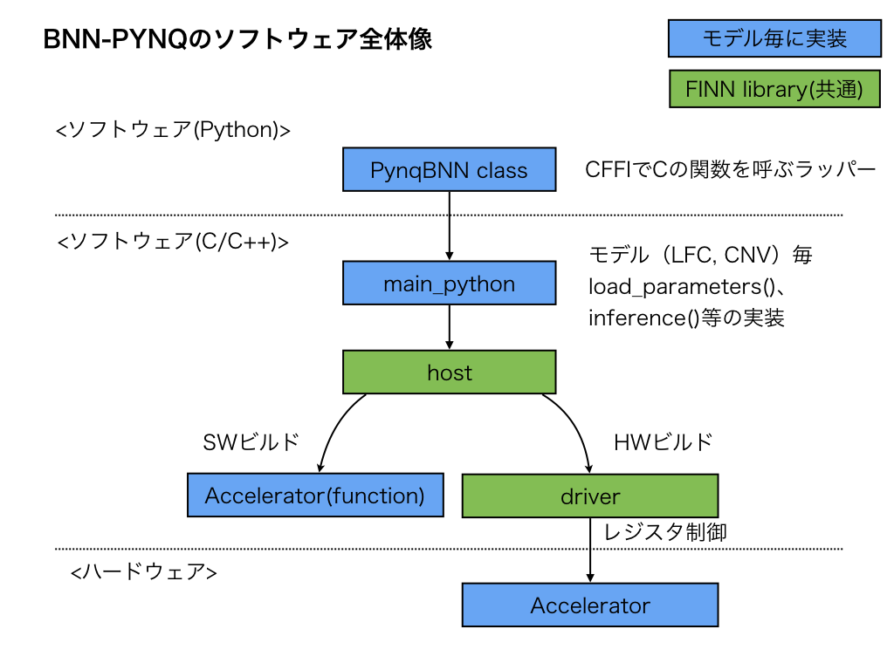

ソフトウェア全体像
==================

BNN-PYNQのソフトウェアの構成を図にしてみました。

* 青色の箱が、モデル毎に実装する必要があるモジュール
    * ソースは、 `bnn/src/network <https://github.com/Xilinx/BNN-PYNQ/tree/master/bnn/src/network>`_
* 緑色の箱は、FINN libraryと呼ばれており、モデルによらず共通
    * ソースは、 `bnn/src/library <https://github.com/Xilinx/BNN-PYNQ/tree/master/bnn/src/library>`_
    * hostは、上位からの呼び出しに対してSW/HWビルドの差異を吸収する
        * ビルド時の定数マクロで、関数を切り替えている
        * SWビルドのときは、高位合成対象のCの関数を直接呼ぶ
        * HWビルドのときは、driverを介してアクセラレータを制御する
    * driverは、アクセラレータ用のメモリ管理やレジスタ制御を行う
    * hlsは、高位合成時にインクルードされる共通ライブラリ

ソフトウェアシーケンス
===================

LFCで単一画像を推論する場合のシーケンスは以下のようになっています。

* シーケンス上、主要と思われるところを記載。

.. mermaid::

   sequenceDiagram
      participant user
      participant PynqBNN
      participant main
      participant host
      participant driver

      %% __init__
      Note over user, driver: ↓初期化。Overlayをロード
      user->>PynqBNN: __init__()

      %% load parameter
      Note over user, driver: ↓モデルの学習済みパラメータのロード
      user->>PynqBNN: load_parameters()
      PynqBNN->>+main: load_parameters()
      main->>host: FoldedMVInit()
      host->>driver: initPlatform()
      Note over host, driver: アクセラレータのレジスタをmemmap
      loop 全レイヤー
          main->>host: FoldedMVLoadLayerMem()
          host->>host: FoldedMVMemSet()
          host->>driver: レジスタ制御
          Note over host, driver: 学習済の重みをセット。.binファイルを読み込み、レジスタ経由でアクセラレータへセット
      end
      main-->>-PynqBNN: return

      %% inference
      Note over user, driver: ↓推論処理
      user->>PynqBNN: inference()
      PynqBNN->>+main: inference()
      main->>host: FoldedMVInit()
      main->>+host: testPrebinarized_nolabel()
      host->>host: binarizeAndPack()
      host->>driver: copyBufferHostToAccel()
      Note over host, driver: 入力データをアクセラレータ側へコピー

      host->>host: FoldedMVOffloadBinarized()
      host->>driver: writeJamRegAddr()

      host->>host: ExecAccel()
      Note over host, driver: 実行レジスタをキックし、結果をポーリング
      host->>driver: copyBufferAccelToHost()
      Note over host, driver: 推論結果をソフト側へコピー
      host-->>-main: return
      main-->>-PynqBNN: return

      %% __del__
      Note over user, driver: ↓終了処理(暗黙的に呼ばれる)
      user->>PynqBNN: __del__()
      PynqBNN->>+main: deinit()
      main->>host: FoldedMVDeinit()
      host->>driver: deinitPlatform()
      main-->>-PynqBNN: return
